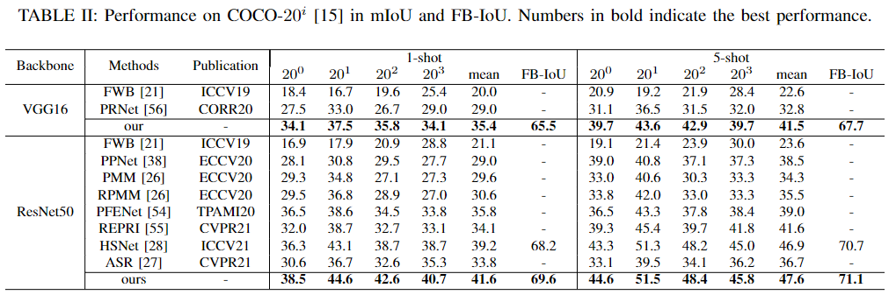

# Boosting Few-shot Semantic Segmentation with Feature-Enhanced Context-Aware Network


Introduction
------------
This is the source code for our paper Boosting Few-shot Semantic Segmentation with Feature-Enhanced Context-Aware Network

Network Architecture
--------------------
The architecture of our proposed model is as follows


### Installation
* Install PyTorch 1.5 with Python 3 
* Clone this repo
```
https://github.com/NUST-Machine-Intelligence-Laboratory/FECANET.git
```

### Data Preparation for VOC Dataset

1. Download VOCdevkit.zip from [here](https://smcp-sh.oss-cn-shanghai.aliyuncs.com/VOCdevkit.zip), unzip and put it under `/data` folder.
2. Download COCO from [here](https://cocodataset.org/#download), unzip and put it under `/data` folder.


### Train and test from scratch 

1. Download the ImageNet-pretrained weights of VGG16 and Resnet50 network from `torchvision`: 
2. To reproduce the 1-shot result reported in Table 1, run the script to train and test for set 0,1,2,3. The example for set 0 is 

```
/train.py --datapath=/data/VOCdevkit --benchmark=pascal --backbone=vgg16/resnet50 --fold=0 --bsz=20 --fold=0  --lr=1e-3 
```

​	3.To reproduce the 1-shot result reported in Table 2, run the script to train and test for set 0,1,2,3. The example for set 0 is 

```
/train.py --datapath=/data/coco --benchmark=coco --backbone=vgg16/resnet50 --fold=0 --bsz=20 --fold=0  --lr=1e-3 --logpath=defalut_logpath
```

​	4.If you continue to train you saved  model, you should add additional parameters, such as

```
/train.py --datapath=/data/coco --benchmark=coco --backbone=vgg16/resnet50 --fold=0 --bsz=20 --fold=0  --lr=1e-3 --resume --loadpath=dir/best_model.pt
```

### Test under 5-shot setting

1. To reproduce the 5-shot result reported in Table 1, run the script to test for set 0,1,2,3. The example for set 0 is 

```
/test.py --datapath=/data/VOCdevkit --benchmark=pascal --backbone=vgg16/resnet50 --nshot=5 --use_original_imgsize --fold=0 --load==dir/best_model.pt --lr=1e-3 --bsz=20
```

2. To reproduce the 5-shot result reported in Table 2, run the script to test for set 0,1,2,3. The example for set 0 is 

```
/test.py --datapath=/data/coco --benchmark=coco --backbone=vgg16/resnet50 --nshot=5 --use_original_imgsize --fold=0 --load==dir/best_model.pt --lr=1e-3 --bsz=20
```

3. if you want  to get visualization of predicated map, you should add additional parameters, such as

```
/test.py --datapath=/data/VOCdevkit --benchmark=pascal --backbone=vgg16/resnet50 --nshot=5/1 --fold=0 --load==dir/best_model.pt  --lr=1e-3 --bsz=20 --visualize --visual_fold_name=defalut_visual_fold_name
```

### Test with our pretrained model.

1. Download our pretrained model for fold 0 model stored in pretrained_model fold 

2. To reproduce the result reported in Table 1 69.20(1-shot), 72.9(5-shot) of PASCAL-5_1 ), run 
```
/test.py --datapath=/data/VOCdevkit --benchmark=pascal --backbone=vgg16/resnet50 --nshot=1/5 --fold=0 --load==/pretrained_model/dense+our_pascal{0}_resnet.log/best_model.pt --lr=1e-3 --bsz=20 --use_original_imgsize
```

Experiment Results
--------------------
The experiment results on PASCAL-5i dataset


The experiment results on COCO-20i dataset



## Acknowledgement

We borrow code from public projects (huge thanks to all the projects). We mainly borrow code from [HSNet](https://github.com/juhongm999/hsnet).